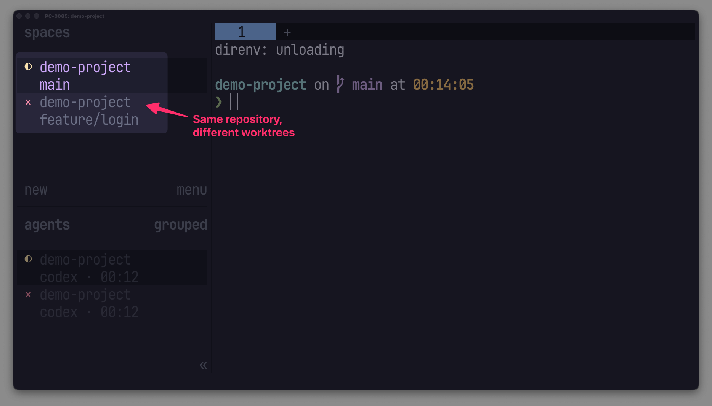

# Herdr Repository Identity

> Add each workspace's shared Git repository name to Herdr's Space sidebar.



If `main` and `feature/login` are worktrees of a repository named `demo-project`, the plugin
reports `$repo=demo-project` for both workspaces.

## Install

Installation requires Herdr 0.8.2 or newer, Git, and Go 1.22 or newer:

```sh
herdr plugin install choplin/herdr-plugins/herdr-repository-identity
```

The manifest builds a native binary during installation, so the plugin has no runtime language
dependency. Git remains a runtime dependency because the plugin uses it to resolve repository
identity.

## How it works

For each workspace, the plugin reads the working directory from its active tab and derives the
repository name from Git's common directory. It reports that name as the `$repo` metadata token on
the workspace and its panes. Outside a Git repository, it falls back to the workspace label.

## Manual reconciliation and logs

The plugin reconciles repository identities automatically when Herdr starts and when relevant
workspace, tab, or pane events occur. To reconcile manually:

```sh
herdr plugin action invoke reconcile --plugin choplin.repository-identity
```

Inspect command logs with:

```sh
herdr plugin log list --plugin choplin.repository-identity
```

## Local development

`herdr plugin link` does not run manifest build commands, so build before linking:

```sh
nix develop
cd herdr-repository-identity
go build -trimpath -o herdr-repository-identity ./cmd/herdr-repository-identity
herdr plugin link .
```

Run the test suite with:

```sh
go test ./...
```
